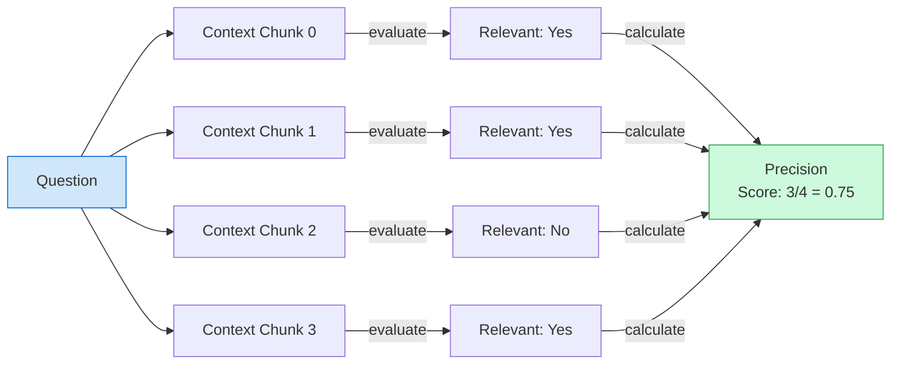

```mermaid
graph LR
    Q[Question] --> C0[Context Chunk 0]
    Q --> C1[Context Chunk 1]
    Q --> C2[Context Chunk 2]
    Q --> C3[Context Chunk 3]
    C0 --> |evaluate| E0[Relevant: Yes]
    C1 --> |evaluate| E1[Relevant: Yes]
    C2 --> |evaluate| E2[Relevant: No]
    C3 --> |evaluate| E3[Relevant: Yes]
    E0 --> |calculate| P[Precision\nScore: 3/4 = 0.75]
    E1 --> |calculate| P
    E2 --> |calculate| P
    E3 --> |calculate| P
    
    style Q fill:#d0e6fa,stroke:#0366d6
    style P fill:#cdfadc,stroke:#28a745
```