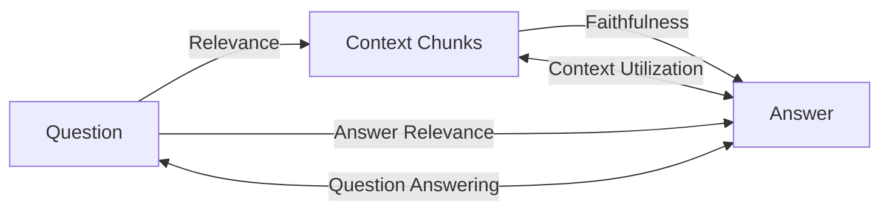

# Systematic Decomposition of RAG Evaluations

RAG systems involve three core components: the question, the retrieved context chunks, and the generated answer. By examining the relationships between these components, we can systematically decompose RAG evaluations into distinct metrics that assess different aspects of the system's performance.

## Core Components

- **Question (Q)**: The user's original query
- **Context Chunks (C)**: The pieces of information retrieved from a knowledge base
- **Answer (A)**: The response generated based on the question and context

## Evaluation Relationships

We can express RAG evaluations in terms of relationships between these components. For each pair, we evaluate how well one component relates to another:



Let's examine each of these relationships:

## 1. Question → Context Chunks: Context Relevance (C|Q)

This evaluates how well the retrieved chunks relate to the question.

**Also known as**: 
- Context Precision
- Retrieval Relevance 
- Contextual Relevancy

**Metrics in this dimension:**

- **Context Precision**: What proportion of retrieved chunks are relevant to the question?
- **Context Recall**: Does the retrieved context contain all the information needed to provide a complete answer?
- **Context Relevance**: How relevant is each specific chunk to the question?

**Example metric**: 
- Percentage of retrieved documents relevant to the query (Myscale +4)
- In RAG Evals: `ChunkPrecision` class in `metrics/precision.py`

**Example:**
```
Question: "What are the health benefits of meditation?"
Context Chunks:
[0] "Regular meditation reduces stress and anxiety."
[1] "Meditation can improve focus and attention span."
[2] "The history of meditation dates back to ancient civilizations."

Evaluation:
- Chunks 0 and 1: Highly relevant (directly address health benefits)
- Chunk 2: Not relevant (discusses history, not health benefits)
Context Precision Score: 2/3 = 0.67
```

## 2. Context Chunks → Answer: Faithfulness/Groundedness (A|C)

This evaluates how well the answer uses the provided context.

**Also known as**:
- Factuality
- Correctness
- Answer Grounding

**Metrics in this dimension:**

- **Faithfulness/Groundedness**: Does the answer only contain information supported by the context?
- **Citation Accuracy**: Does the answer correctly attribute information to sources?
- **Hallucination Detection**: Does the answer invent information not found in the context?

**Example metric**:
- Ratio of statements in the answer supported by context (Deepeval +5)
- In RAG Evals: `Faithfulness` class in `metrics/faithfulness.py`

**Example:**
```
Context Chunks:
[0] "Regular meditation reduces stress and anxiety."
[1] "Meditation can improve focus and attention span."

Answer: "Meditation has several health benefits, including reduced stress and anxiety and improved focus. It also helps with depression and improves sleep quality."

Evaluation:
- "Reduced stress and anxiety": Faithful (from chunk 0)
- "Improved focus": Faithful (from chunk 1)
- "Helps with depression": Unfaithful (not mentioned in context)
- "Improves sleep quality": Unfaithful (not mentioned in context)
Faithfulness Score: 2/4 = 0.5
```

## 3. Question → Answer: Answer Relevance (A|Q)

This evaluates how well the answer addresses the question.

**Also known as**:
- Response Relevance
- Query-Response Relevance
- Answer Pertinence

**Metrics in this dimension:**

- **Answer Relevance**: Does the answer directly address what was asked?
- **Answer Completeness**: Does the answer fully address all aspects of the question?
- **Answer Correctness**: Is the information in the answer factually accurate?
- **Answer Conciseness**: Is the answer appropriately detailed without unnecessary information?

**Example metric**:
- Semantic similarity between question and answer (Deepeval +10)
- In RAG Evals: `AnswerRelevance` class in `metrics/relevance.py`

**Example:**
```
Question: "What are the health benefits of meditation?"
Answer: "Meditation offers numerous health benefits, including stress reduction, improved concentration, lower blood pressure, and better emotional well-being. Regular practice can help manage anxiety and depression symptoms."

Evaluation:
- Highly relevant (directly addresses health benefits)
- Complete (covers multiple aspects of health benefits)
- Concise (provides appropriate detail without meandering)
Relevance Score: 0.95
```

## 4. Context Chunks ↔ Answer: Context Utilization

This evaluates whether the context was effectively used in generating the answer and whether the answer reflects the context.

**Also known as**:
- Chunk Utility
- Context Usage
- Information Extraction

**Metrics in this dimension:**

- **Context Coverage**: How much of the relevant context was utilized in the answer?
- **Chunk Utility**: Was each individual chunk utilized in the answer?

**Example:**
```
Context Chunks:
[0] "Regular meditation reduces stress and anxiety."
[1] "Meditation can improve focus and attention span."
[2] "The history of meditation dates back to ancient civilizations."

Answer: "Meditation reduces stress and improves focus."

Evaluation:
- Chunk 0: Utilized
- Chunk 1: Utilized
- Chunk 2: Not utilized
Context Utilization Score: 2/3 = 0.67
```

## 5. Question ↔ Answer: Question Answering Quality

This evaluates the overall question-answering quality, regardless of the specific context used.

**Also known as**:
- Answer Quality
- Response Quality
- QA Performance

**Metrics in this dimension:**

- **Answer Accuracy**: Is the answer factually correct for the question?
- **Answer Helpfulness**: Does the answer provide useful information to the user?

**Example:**
```
Question: "What are the health benefits of meditation?"
Answer: "Meditation offers numerous health benefits, including stress reduction, improved concentration, lower blood pressure, and better emotional well-being."

Evaluation:
- Accurate (provides correct health benefits)
- Helpful (gives clear, useful information)
Accuracy Score: 0.9
```

## Combined Evaluation Framework

A comprehensive RAG evaluation should assess all these relationships. This gives a complete picture of system performance:

1. **Retriever Performance**: Question → Context evaluation (Context Relevance)
2. **Generator Performance**: Context → Answer evaluation (Faithfulness/Groundedness)
3. **End-to-End Performance**: Question → Answer evaluation (Answer Relevance)

## Implementation Example

Here's how you might implement a comprehensive evaluation:

```python
# Conceptual example of a comprehensive evaluation
def evaluate_rag_system(question, retrieved_context, generated_answer, ground_truth=None):
    # Retriever evaluation - Context Relevance (C|Q)
    context_precision = evaluate_context_precision(question, retrieved_context)
    context_recall = evaluate_context_recall(retrieved_context, ground_truth) if ground_truth else None
    
    # Generator evaluation - Faithfulness/Groundedness (A|C)
    faithfulness = evaluate_faithfulness(retrieved_context, generated_answer)
    
    # End-to-end evaluation - Answer Relevance (A|Q)
    answer_relevance = evaluate_answer_relevance(question, generated_answer)
    
    return {
        "retriever_performance": {
            "context_precision": context_precision,
            "context_recall": context_recall
        },
        "generator_performance": {
            "faithfulness": faithfulness
        },
        "end_to_end_performance": {
            "answer_relevance": answer_relevance
        }
    }
```

## Relationship to RAG Evals Implementation

The RAG Evals library implements metrics across all these key relationships:

1. **Context Relevance (C|Q)**: Implemented as `ChunkPrecision` in `metrics/precision.py`
   - Evaluates how well each context chunk matches the question

2. **Faithfulness/Groundedness (A|C)**: Implemented as `Faithfulness` in `metrics/faithfulness.py`
   - Evaluates how factually consistent the answer is with the provided context

3. **Answer Relevance (A|Q)**: Implemented as `AnswerRelevance` in `metrics/relevance.py`
   - Evaluates how well the answer addresses the original question

4. **Context Utilization (C↔A)**: 
   - Implemented as `ContextRecall` in `metrics/recall.py` (C→A direction)
      - Evaluates whether all relevant information from the context is included in the answer
   - Implemented as `ChunkUtility` in `metrics/utility.py` (also considers both C→A and Q→A)
      - Evaluates how useful each context chunk was for generating the answer

## Advantages of Systematic Decomposition

Breaking down RAG evaluation into these component relationships offers several advantages:

1. **Targeted Improvements**: Identify which specific component needs improvement
2. **Comprehensive Assessment**: Evaluate all aspects of the RAG pipeline
3. **Diagnostic Power**: Pinpoint exact causes of system failures
4. **Component-wise Optimization**: Optimize retriever and generator independently

By systematically evaluating each relationship between question, context, and answer, we can build more effective and reliable RAG systems.